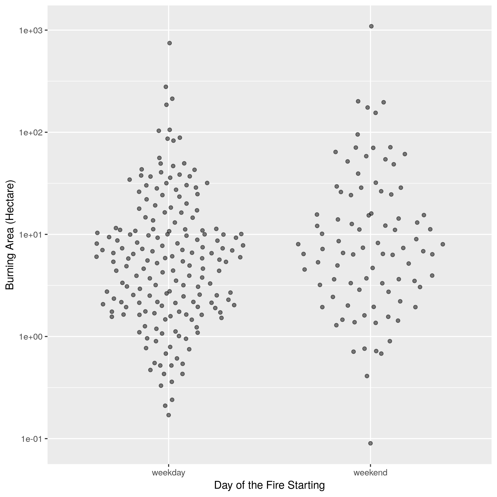
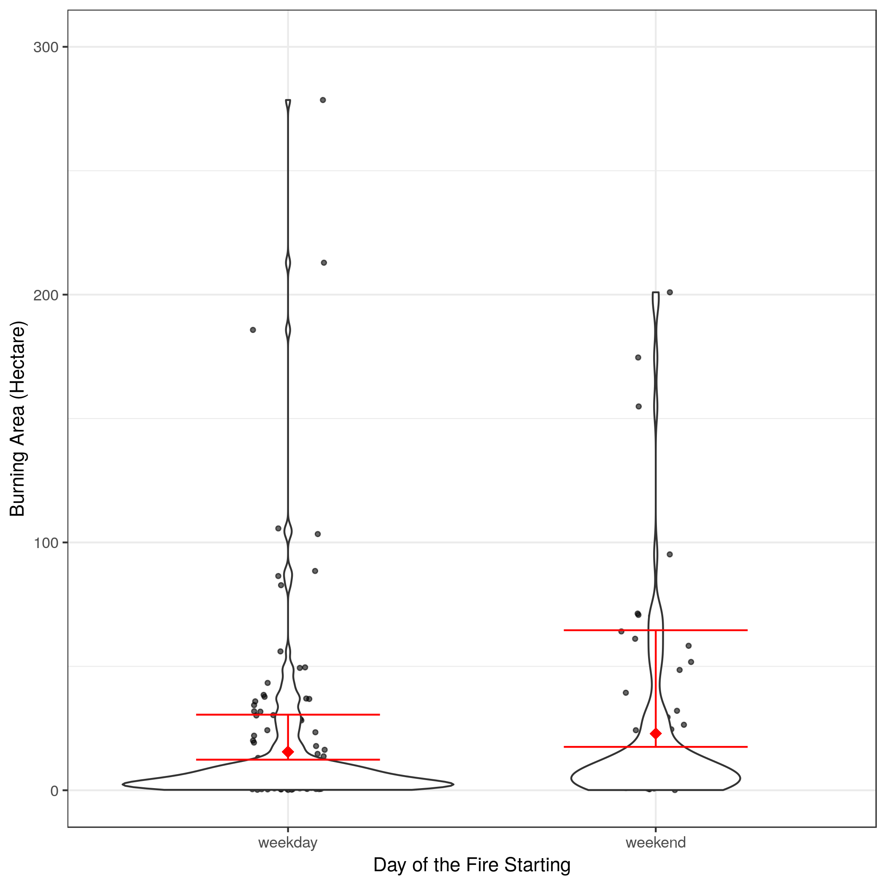
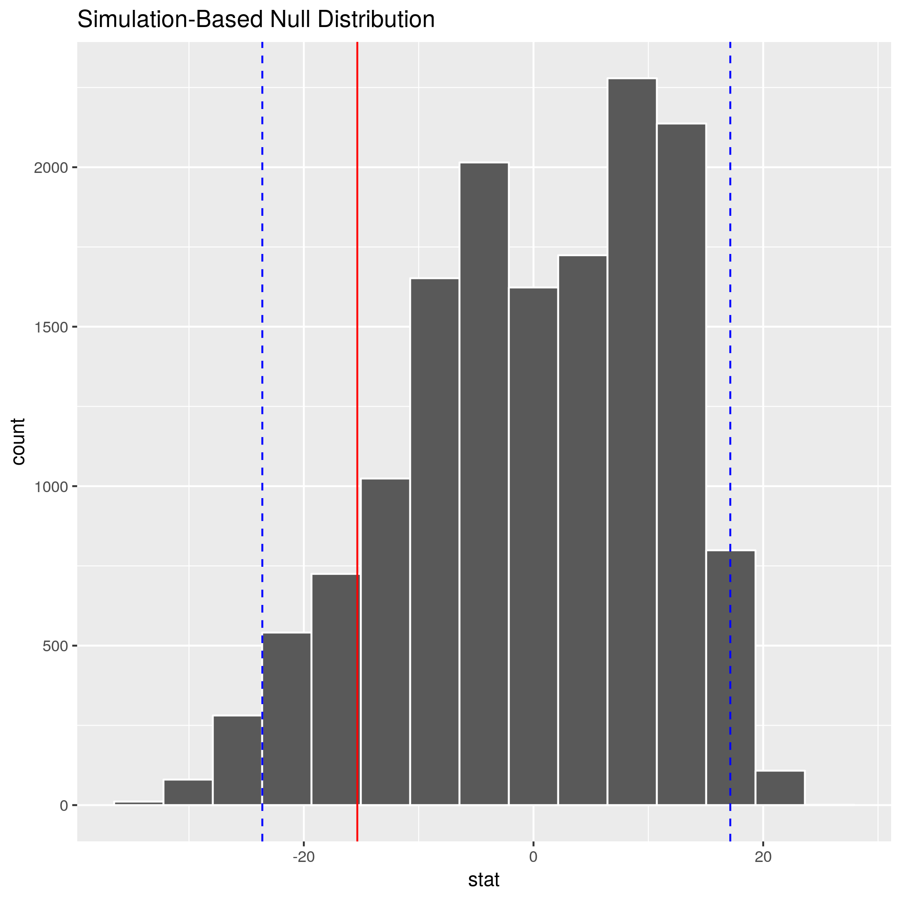

DSCI 522 Forest Fire Analysis
================
Jim Pushor, Weifeng Guo
November 24, 2018

# Report

## Introduction

The purpose of the project was to explore a data set featuring forest
fires in a national park of Portugal. We decided on an inferential
question: **Do fires that begin on weekends burn more area on average
than fires that begin on weekdays?** This question was spun out of
exploring the raw data set table (Table 1).

``` r
library(knitr)
FFR_data <- read.csv("../data/FFRSample.csv")
FFC_data <- read.csv("../data/FFCSample.csv")
FFS_data <- read.csv("../data/Summarized_Data.csv")
```

The raw data set below included many features that are typical to forest
fire analysis; however, considering question criteria outlined in *The
Art of Data Science* By Roger Peng and Elizabeth Matsui, we chose a
question that may not have been answered from this data.

*Table 1. Forest Fire Raw Dataset
Sample*

| X | Y | month | day | FFMC |   DMC |    DC |  ISI | temp | RH | wind | rain |    area |
| -: | -: | :---- | :-- | ---: | ----: | ----: | ---: | ---: | -: | ---: | ---: | ------: |
| 6 | 5 | sep   | sat | 92.5 | 121.1 | 674.4 |  8.6 | 25.1 | 27 |  4.0 |    0 | 1090.84 |
| 8 | 6 | aug   | thu | 94.8 | 222.4 | 698.6 | 13.9 | 27.5 | 27 |  4.9 |    0 |  746.28 |
| 7 | 4 | jul   | mon | 89.2 | 103.9 | 431.6 |  6.4 | 22.6 | 57 |  4.9 |    0 |  278.53 |
| 1 | 2 | sep   | tue | 91.0 | 129.5 | 692.6 |  7.0 | 18.8 | 40 |  2.2 |    0 |  212.88 |
| 2 | 2 | sep   | sat | 92.5 | 121.1 | 674.4 |  8.6 | 18.2 | 46 |  1.8 |    0 |  200.94 |
| 8 | 6 | aug   | sun | 91.4 | 142.4 | 601.4 | 10.6 | 19.6 | 41 |  5.8 |    0 |  196.48 |

**Feature Descriptions in Raw Dataset**

1.  X - x-axis spatial coordinate within the Montesinho park map: 1 to 9
2.  Y - y-axis spatial coordinate within the Montesinho park map: 2 to 9
3.  month - month of the year: “jan” to “dec”
4.  day - day of the week: “mon” to “sun”
5.  FFMC - FFMC index from the FWI system: 18.7 to 96.20. Fine Fuel
    Moisture Code (FFMC) of the Fire Weather Index (FWI) is a an
    indexing of the moisure content of litter and other cured fine
    fuels.
6.  DMC - DMC index from the FWI system: 1.1 to 291.3. Duff Moisture
    Code (FFMC) of the Fire Weather Index (FWI) is an indexing of the
    moisure content of loosely compacted organic layers of moderate
    depth.
7.  DC - DC index from the FWI system: 7.9 to 860.6. Drought Code (DC)
    of the Fire Weather Index (FWI) is an indexing of the moisure
    content of deep, compact organic layers.
8.  ISI - ISI index from the FWI system: 0.0 to 56.10. Initial Spread
    Index (ISI) is a numeric rating of the expected rate of fire spread.
9.  temp - temperature in Celsius degrees: 2.2 to 33.30
10. RH - relative humidity in %: 15.0 to 100
11. wind - wind speed in km/h: 0.40 to 9.40
12. rain - outside rain in mm/m2 : 0.0 to 6.4
13. area - the burned area of the forest (in ha): 0.00 to 1090.84 -
    skewed toward 0.00.

**Data Wrangling and Production of Subset of Data**  
Prior to doing further analysis, we needed to perform some data cleaning
and wrangling. Using `Table 1` we removed any of the rows where the
burnt area was zero. A zero value indicated an extremely small or
neglibable burn area, which could skew our results. We wanted to focus
on the the fire events that resulted in measurable burnt area.

In addition to removing zero valued rows for area burned. We classified
the days of the week into two groups. One group, `Weekday` included all
the weekdays and the other group, `Weekend` included all the weekend
days.

*Table 2. Subset of Forest Fire **Clean** Dataset Sample*

| Day\_Category | Area\_Burned |
| :------------ | -----------: |
| weekday       |         0.36 |
| weekday       |         0.43 |
| weekday       |         0.47 |
| weekday       |         0.55 |
| weekday       |         0.61 |
| weekend       |         0.71 |

## Visualization (EDA)

We explored our clean data by creating a distribution plot to compare
the fire events on a weekend to a weekday. Our general observation was
that they were similarly distributed relative to burnt area. Most of the
fire event observations, at first glance, appear to cluster around the
the same size of fire regardless of the category of day (weekday or
weekend day). There are more observations occuring in the weekday
category, but we are assuming this is because there are more weekdays
than weekend days.

*Figure 1. Distribution Plot of Forest Fires Weekday vs. Weekend Days*



## Analysis

Through repeated simulations, we completed a difference in means null
hypothesis test to determine if there was enough evidence to reject our
null hypothesis: There is no difference in mean size of fire between the
two groups: fires that start on a weekday vs. fires that start on a
weekend day.

We produced a data summation table with lower and upper confidence
intervals and the means of the two groups. *The difference of means of
the observed data was 15.34 hectares*

*Table 3. Data Summary Statistics Showing 95% Confidence Intervals and
Mean Values of Area Burnt (hectares)*

| Day         | Lower\_CI | Upper\_CI | Mean\_Area\_Burned |
| :---------- | --------: | --------: | -----------------: |
| Weekday     |  12.35087 |  30.51061 |           19.54287 |
| Weedend Day |  17.50721 |  64.57353 |           34.88528 |

The following violin plot shows the distribution of the fires with the
above confidence intervals and means noted for each group. The weekend
group shows a larger range for the confidence intervals which suggests
greater variation of values, as well as, a consequence of the effect of
a relatively smaller data set.

*Figure 2. Distribution Plot of Size of Burnt Area by Day Type*  
*95% Confidence Intervals and Means Shown in Red*



After completing the null hypothesis, we visualized our observed
difference in means between the two groups compared to the null
hypothesis distribution. The resulting histogram shows that our observed
value is inside the range of our 95% confidence intervals. With a pvalue
of 0.158, and the alpha set at 0.05, there is not enough evidence to
reject the null hypothesis that the two means are different.

*Figure 3. Histogram of Null Hypothesis Distribution with Observed Diff
of Means Value in Red* *95% Confidence Intervals in Blue*



## Conclusion

The difference in means null hypothesis test produced not enough
evidence to reject the null hypothesis. We can say that given the null
hypothesis is true, the probability of us seeing a similar observation
of at least or greater extreme is likely enough (~16%) for us to not
dismiss the null hypothesis statement.

#### Critique and Future Steps

On reflection, there are a few things to consider:

  - Though we are testing the difference of means of a subpopulation of
    a feature, it may be more appropriate to do muliple regression
    testing to understand how the different features impact the response
    variable: burnt area. Some features will be a stronger explanatory
    variable than others. It is difficult to conclude from our analysis
    that only the day of the week has an impact on the size of the fire,
    while isolating the other influentual factors like wind speed and
    temperature.  
  - We made an assumption that there may be a different response rate on
    weekends versus weekdays because of the availability of resources.
    This was not substantiated.
  - We do not know the priority of fighting these fires in the park. It
    may be the case that the fire fighting is triaged based on risk to
    public safety, versus risk of area burned.

**References**

[UCI Machine Learning Data
Sets](https://archive.ics.uci.edu/ml/datasets/Forest+Fires)  
Peng, Roger and Elizabeth Matsui. “The Art of Data Science: A Guide for
Anyone Who Works with Data” Leanpub. 2018. [Canadian Wildfire Fire
Information](http://cwfis.cfs.nrcan.gc.ca/background/summary/fwi)
